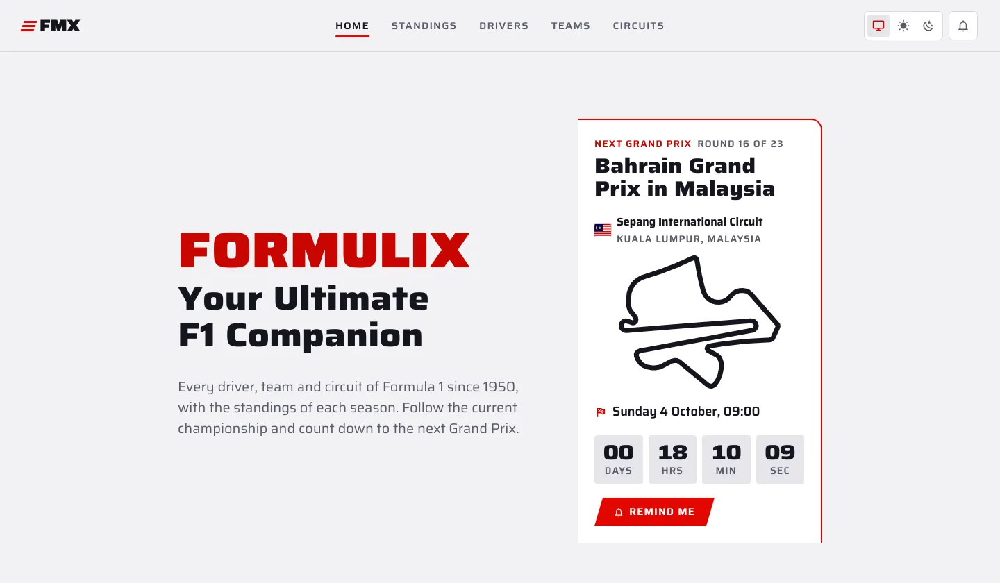
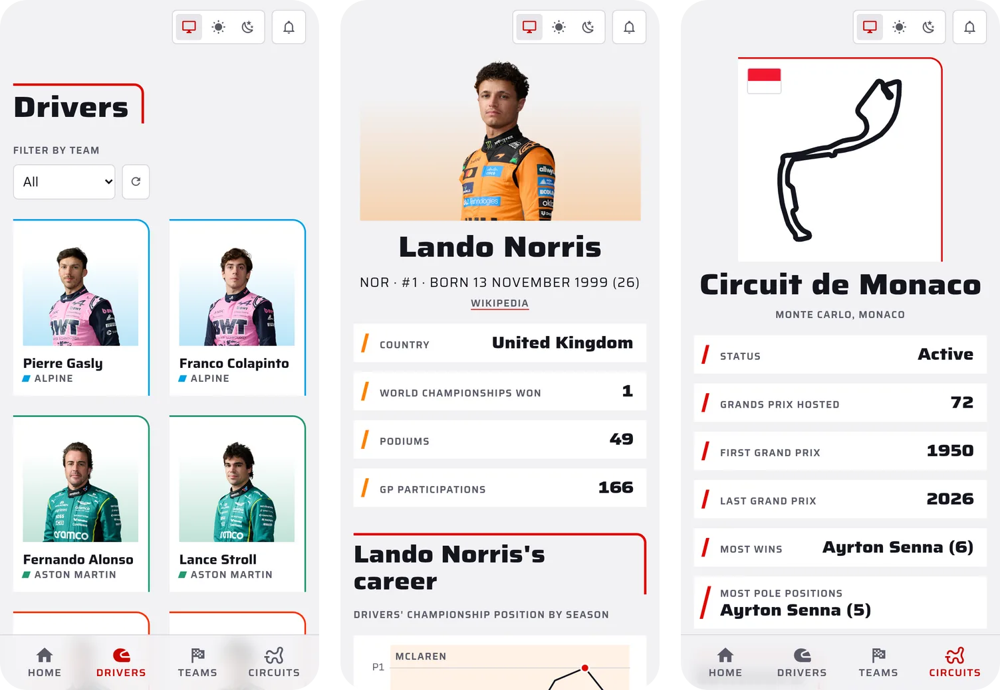

<div align="center">
  
  <h1>Formulix</h1>
  <p>
    <strong>Your ultimate F1 companion.</strong><br>
    Drivers, teams and circuits from more than 70 years of Formula 1, in a web app you can install.
  </p>
  <p>
    <a href="https://formulix.baptistemiramont.fr"><strong>Open the app</strong></a>
    ·
    <a href="#features">Features</a>
    ·
    <a href="#getting-started">Getting started</a>
  </p>
  <p>
    <a href="https://github.com/baptistemiramont/formulix-app/actions/workflows/deploy.yml"></a>
    
    
    
    
  </p>
</div>

<picture>
  <source media="(prefers-color-scheme: dark)" srcset=".github/readme/home-dark.webp">
  
</picture>

## Features

- **Standings**: the drivers' and constructors' championships of the current season, then of every season before it, back to 1950 for the drivers and 1958 for the constructors, the top three on a podium.
- **Drivers**: every driver who started a Grand Prix since 1950, with their stats, identity and teams, and a chart of their championship position season by season. The list searches by name and filters by current team, nationality and world champions.
- **Teams**: every team since 1950 with its titles, successive identities, current and former drivers, and its constructors' championship position season by season. The list searches by name and filters by status and constructors' champions.
- **Circuits**: the layout and stats of each circuit, with the winner, team and pole position of every Grand Prix it hosted. The list searches by name, city or country and filters by status and country.
- **Searchable lists**: drivers, teams and circuits come 24 to a page, searched and filtered by the API, with the count of what is left; each list finds its search, filters and page again on the way back.
- **Grand Prix reminders**: a push notification three days before each Grand Prix, at 10 am in the device's time zone.
- **Light, dark or system theme**, in a visual identity drawn from Formula 1: F1 red, carbon, the wide Saira typeface and team colours.
- **Installable app** on iOS, Android and desktop, edge to edge, with haptic feedback on key gestures.

<picture>
  <source media="(prefers-color-scheme: dark)" srcset=".github/readme/screens-dark.webp">
  
</picture>

## Tech stack

| Area | Tools |
| --- | --- |
| UI | [React](https://react.dev), [TypeScript](https://www.typescriptlang.org) |
| Routing and data | [TanStack Router](https://tanstack.com/router), [TanStack Query](https://tanstack.com/query), [Zod](https://zod.dev) |
| Styling | [Panda CSS](https://panda-css.com), [Saira](https://fonts.google.com/specimen/Saira) |
| Animation | [GSAP](https://gsap.com) |
| Build and PWA | [Vite](https://vite.dev), [Vite PWA](https://vite-pwa-org.netlify.app) |
| Quality | [ESLint](https://eslint.org) |
| Delivery | GitHub Actions, nginx |

## Getting started

The app reads its data from the Formulix API, a separate private service: running it locally takes the API's URL and a key.

Requirements: Node.js 20.19 or later (or 22.12 or later) and npm.

1. Set the environment variables:

    ```sh
    cp .env.example .env
    ```

    | Variable | Description |
    | --- | --- |
    | `VITE_API_URL` | Base URL of the Formulix API |
    | `VITE_API_KEY` | Key sent with every API request |

2. Install the dependencies:

    ```sh
    npm install
    ```

3. Start the development server:

    ```sh
    npm run dev
    ```

    The app runs at [http://localhost:1111](http://localhost:1111).

4. Add the pre-commit hook, which runs ESLint on staged files:

    ```sh
    cp git/pre-commit .git/hooks
    ```

### Scripts

| Command | Description |
| --- | --- |
| `npm run dev` | Development server with hot reload |
| `npm run build` | Type-check, then production build in `dist/` |
| `npm run preview` | Serve the production build locally |
| `npm run lint` | ESLint over the whole project |
| `npm run build-circuit-layouts` | Redraw the circuit layouts in `src/assets/circuits` |

## Project structure

```text
src/
├── api/          Requests to the Formulix API, validated with Zod
├── components/   Reusable components: cards, form fields, charts, theme switcher…
├── hooks/        Data fetching, theme, reminders, media queries
├── layouts/      Header, footer and page shell
├── pages/        One component per route
├── router/       Route tree
└── styles/       Shared style objects
public/           Icon source and service worker for reminders
scripts/          Circuit layout generation
```

## Deployment

Every push to `main` runs ESLint, builds the app and publishes `dist/` to the server over rsync. The nginx virtual host lives in [`site.nginx`](site.nginx).

## Credits

- Circuit layouts drawn from [bacinger/f1-circuits](https://github.com/bacinger/f1-circuits) (MIT, see [`src/assets/circuits/LICENSE.md`](src/assets/circuits/LICENSE.md)).
- [Saira](https://fonts.google.com/specimen/Saira) typeface by Omnibus-Type, under the SIL Open Font License.
- Icons from [Material Design Icons](https://pictogrammers.com/library/mdi/), through [Iconify](https://iconify.design).

## Disclaimer

Formulix is an independent fan project. It is not affiliated with, endorsed by, or associated with Formula One, the FIA, or any official Formula 1 team, sponsor, driver or organisation. All logos, names, images and brand references belong to their respective owners.

---

<p align="center">Made by <a href="https://baptistemiramont.fr">Baptiste Miramont</a></p>
